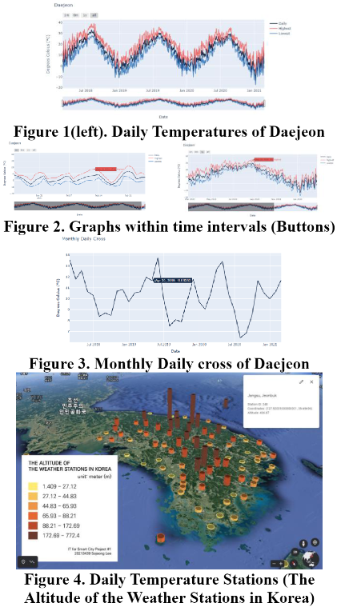

# IT for Smart City

Date Created: November 7, 2022 11:36 PM

# IT for Smart City

> 데이터 분석을 활용하여 스마트시티 분야의 크고 작은 문제 해결을 실습하는 수업.
> 

## 1. 프로젝트 개요

- 수강 기간: 석사 1학기 (2021.03. - 2021.06.)
- 참여 인원: 개인 프로젝트
- 활용 데이터: 다양한 분야에서 센서 데이터, 측정 데이터 등의 Open Source 링크를 수업에서 제공
- 사용 기술 / 데이터 분석 방법:
    - Python 데이터 분석 (Pandas, NumPy, SciPy, PyWavelets), Python 시각화(Plotly, Seaborn, Matplotlib)

## 2. 프로젝트 핵심 내용 및 역할

- 과제 예시
    
    
    - Project 1: 대전광역시의 기온 변화 시각화 및
    고도에 따른 기온 측정소의 온도 차이 시각화
        
        
        
    
    - Project 5: 주성분분석(PCA)을 통한 차원 축소 및 3D 데이터의 분석
    
    
    

## 3. 성과 및 배운점

- 학점 A0
- 과제 발표 및 토론을 통해 데이터 분석 피드백 경험
- 동일한 과제라도 분석가의 해석에 따라 데이터 분석의 인사이트가 달라진다는 것을 느낌